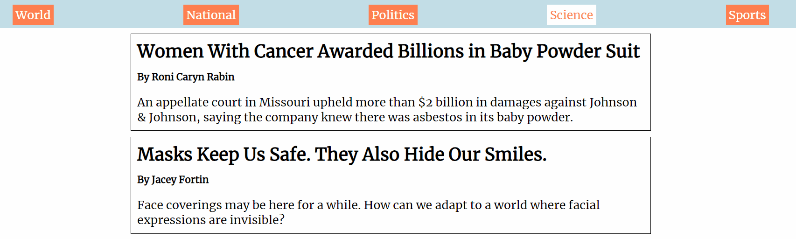
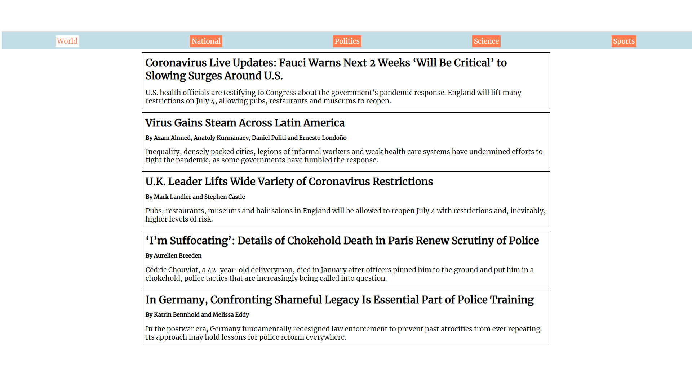

# Top Stories 📰

> Deliver trending articles from the New York Times

This is a frontend application built with React. It uses the New York Times Top Stories API to display the top five articles for various sections.

<!--


-->

# Quick Start 🚀

Create an account at the [NY Times Dev Portal](https://developer.nytimes.com/get-started) and make a new app. Under the _APIs section_ select the **Top Stories API**.

## Install dependencies

```
    npm install
```

## Add a .env file to the root with the following

```
    REACT_APP_API_KEY = <your_api_key>
```

## Run

```
    npm start
```
